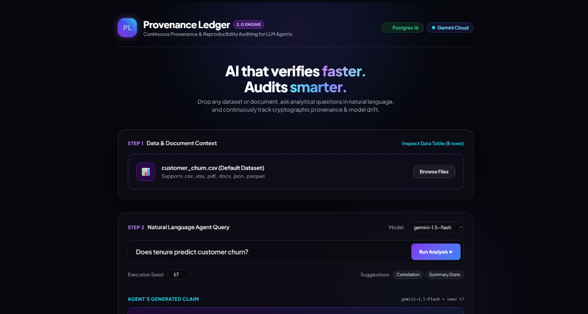
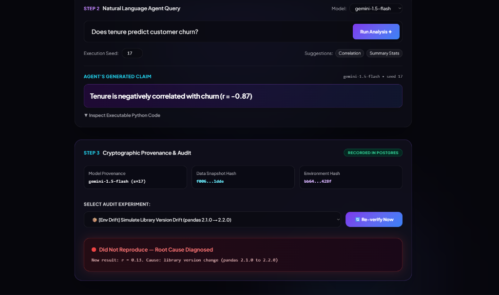
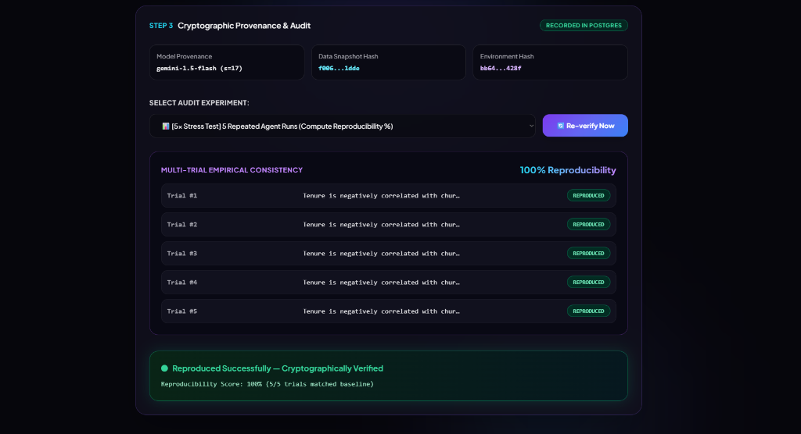
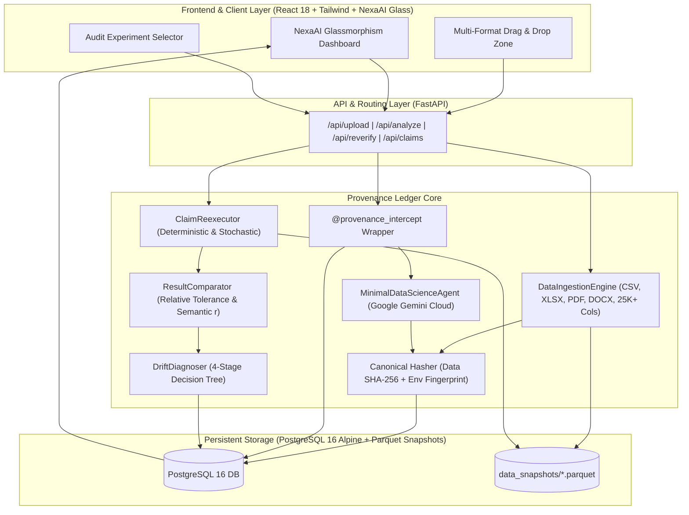

# 🌌 Provenance Ledger

<div align="center">

### **Continuous Provenance, Cryptographic Verification & Automated Drift Diagnosis for Autonomous AI Data Science Agents**

[](https://www.python.org/)
[](https://www.postgresql.org/)
[](https://fastapi.tiangolo.com/)
[](https://ai.google.dev/)
[](https://pytest.org/)

<br/>



</div>

---

## 📸 Product Tour & Live Capabilities

<div align="center">

### 1. Zero-Intrusive File Ingestion & Natural Language Agent Reasoning
*Upload any spreadsheet (`.csv`, `.xlsx`), raw document (`.pdf`, `.docx`), or large matrix (up to 25,000+ columns). Ask analytical questions in natural language—Google Gemini (`gemini-3.6-flash`) writes and executes verified Python/Pandas/SciPy code in memory while capturing immutable cryptographic fingerprints in PostgreSQL 16.*

<br/>

### 2. Cryptographic Ledger & Automated Drift Diagnosis
*Immutable cryptographic hashes (`data_snapshot_hash`, `env_hash`) stored in PostgreSQL 16. If an environment drift occurs (e.g. `pandas 2.1.0` $\rightarrow$ `2.2.2` or `numpy 1.26.4` $\rightarrow$ `2.1.0`), the root-cause decision tree isolates the exact package divergence.*



<br/><br/>

### 3. Multi-Trial Empirical Consistency Stress Testing
*Runs 5 repeated stochastic agent trials across temperature and seed sweeps to calculate the empirical Reproducibility Score ($\mathcal{R}_{score} = 100\%$) and trial variance breakdown.*



</div>

---

## 📜 The Lore: The Silent Crisis of Agentic Data Science

> *"When an autonomous AI agent claims **'Tenure mitigates churn (r = -0.42)'**, how do you prove it wasn't a phantom created by a silent library upgrade or random sampling jitter?"*

### ⚡ The Dilemma: The Disappearing Chain of Evidence
Autonomous LLM agents are rapidly taking the reins of enterprise data analysis. They ingest spreadsheets, write dynamic pandas code on the fly, and output high-stakes numerical claims.

**Three weeks later, an automated re-run reports $r = -0.31$.** Why?
- 📉 **Did the raw data mutate?** (Data drift)
- 📦 **Did a minor package upgrade (`pandas 2.1.0` → `2.2.2`) silently alter calculation routines?** (Library drift)
- ⚡ **Did the cloud LLM silently update its weights?** (Model version shift)
- 🎲 **Or was it pure stochastic sampling jitter?**

In modern data stacks, **nobody knows**. The code executed in an ephemeral sandbox, the dataset snapshot was never cryptographically hashed, and the environment was never fingerprinted.

### 🛡️ The Paradigm Shift: Why Provenance Ledger?

Existing MLOps and LLM observability tools were designed for a different era. **Provenance Ledger builds the missing cryptographic audit layer**:

| Capability | Traditional MLOps *(MLflow / W&B)* | LLM Observability *(LangSmith / Langfuse)* | **Provenance Ledger** 🌌 |
| :--- | :--- | :--- | :--- |
| **Core Focus** | Model weights & training loss | Token counts & prompt latency | **Analytical claims, code determinism & silent drift** |
| **Data Lineage** | ⚠️ Raw file paths / URLs | ❌ No data awareness | ✅ **Canonical SHA-256 in-memory DataFrame snapshots** |
| **Root-Cause Attribution** | ❌ Manual debugging | ❌ Manual inspection | ✅ **Automated 4-stage decision tree** (Model vs Lib vs Data vs Jitter) |
| **Reproducibility Metric** | ❌ None | ❌ None | ✅ **Empirical Multi-Trial Scoring ($\mathcal{R}_{score} \in [0\%, 100\%]$)** |
| **Universal Ingestion** | ⚠️ CSV only | ❌ Prompt text only | ✅ **Spreadsheets, PDFs, Word docs, Parquet, 25K+ Col Matrices** |

Just as financial ledgers audit every cent, **Provenance Ledger audits every analytical claim**—turning ephemeral AI data science into a verifiable, self-diagnosing engineering discipline.

---

## ✨ Core Pillars & Capabilities

```
                       ┌──────────────────────────────────────────────┐
                       │          PROVENANCE LEDGER ENGINE            │
                       └──────────────────────┬───────────────────────┘
                                              │
         ┌────────────────────────┬───────────┴───────────┬────────────────────────┐
         ▼                        ▼                       ▼                        ▼
 📁 Multi-Format Ingest   🛡️ Non-Intrusive Intercept  🔬 Root-Cause Diagnoser   📊 Empirical Stress Testing
 • .csv, .xlsx, .xls      • @provenance_intercept    • Model Version Shifts    • 5x Stochastic Trials
 • .pdf, .docx, .json     • Invariant Data SHA-256   • Library Version Drift   • Thermal Sweeps (T=0.7)
 • 25,000+ Col Matrices   • Env Package Tree Hash    • NumPy 2.0 / SciPy Drift • Bootstrap Subsampling
 • Immutable Snapshots    • Zero-Intrusive Context   • Data Mutation Spikes    • Variance Scoring
```

- **Universal Multi-Format Ingestion**: Ingests spreadsheets (`.csv`, `.tsv`, `.xlsx`, `.xls`), raw documents (`.pdf`, `.docx`), and large matrices (up to 25,000+ columns) with token-safe previewing and automatic snapshotting.
- **Zero-Intrusive Capture Layer**: A single decorator (`@provenance_intercept`) wraps any agent function without modifying underlying business logic.
- **Order-Invariant Canonical Hashing**: Column-order and float-precision invariant SHA-256 fingerprinting ensures datasets are verified with zero false mismatches.
- **High-Performance Cloud Reasoning**: Powered by **Google Gemini Cloud** (`gemini-3.6-flash`, `gemini-pro-latest`, `gemini-2.5-flash-lite`) with rate-limit resilient model cascading.
- **Full Scientific Python Stack**: Pre-injected runtime support for `scipy` (v1.18+), `scikit-learn` (v1.9+), `statsmodels` (v0.14+), `pandas` (v2.2+), and `numpy` (v2.0+).
- **Automated Root-Cause Decision Tree**: Isolates whether a failure is caused by `model_version_change`, `library_version_change` (with exact package diffs), `data_change`, or `stochastic_variation`.
- **Empirical Multi-Trial Consistency Audits**: Runs multi-trial stress tests across seeds and temperatures to compute true reproducibility percentages ($\mathcal{R}_{score} \in [0\%, 100\%]$).
- **NexaAI-Inspired Glassmorphism UI**: High-tech interactive dashboard featuring ambient purple/cyan radial glows, dataset schema inspector, and a **dual-ring orbital radar audit loader**.

---

## 🔬 The 11 Real-World Audit Experiments

Provenance Ledger features a comprehensive suite of **11 live audit experiments** to stress-test any analytical claim:

### 1. 🎯 Real-World Determinism & Model Scale Tests
- **`[Exact Baseline] Rerun Stored Code on Immutable Data Snapshot`**: Deterministic bit-for-bit baseline re-execution against the cryptographic snapshot.
- **`[Canonical Invariance] Shuffle Column Order`**: Randomly permutes column indices to prove the system’s canonical SHA-256 and calculations are order-invariant.
- **`[Model Jitter] Re-invoke Gemini from Scratch`**: Re-prompts Google Gemini with identical prompt and seed to detect unpinned model variance.
- **`[Model Tier Shift] Re-verify with Gemini Flash Lite`**: Tests claim validity when downscaling to lighter models.
- **`[Model Scale Shift] Re-verify with Gemini Pro Latest`**: Verifies whether advanced frontier reasoning models reach the same conclusion.

### 2. 📊 Stochastic & Robustness Stress Tests
- **`[5x Stress Test] 5 Repeated Agent Runs`**: 5 multi-trial stochastic sweeps to calculate the empirical **Reproducibility Score ($\mathcal{R}_{score} \in [0\%, 100\%]$)**.
- **`[Thermal Sensitivity] High Temperature Sweep (T=0.7)`**: Evaluates whether the claim holds under high sampling temperature/randomness.
- **`[Bootstrap Subsampling] 80% Random Data Resampling`**: Tests if the analytical finding is robust across random 80% subsets of data or just an artifact of sample selection.
- **`[Numerical Noise] Injects $\epsilon = 10^{-6}$ Precision Jitter`**: Injects floating-point micro-jitter to detect chaotic numerical instability.

### 3. 📦 Library & Environment Drifts
- **`[Pandas Drift] pandas 2.1.0 → 2.2.2`**: Simulates silent Pandas version shifts (e.g. changes in `Series.corr()` default interpolation, NA handling, and indexing).
- **`[NumPy 2.0 ABI Drift] numpy 1.26.4 → 2.1.0`**: Simulates NumPy 2.0 type promotion rules, scalar casting differences, and float precision shifts.
- **`[SciPy Stats Drift] scipy 1.11.4 → 1.14.0`**: Simulates changes in statistical solver optimization tolerances, asymptotic p-value approximations, and `chi2_contingency` corrections.
- **`[Scikit-Learn Drift] scikit-learn 1.3.2 → 1.5.1`**: Simulates estimator default regularizer shifts, solver convergence criteria, and random state seeding changes.
- **`[Cascading Multi-Dep Drift] Full Stack Upgrade`**: Simulates simultaneous updates across the entire Python scientific stack (`pandas`, `numpy`, `scipy`, `scikit-learn`, `statsmodels`).
- **`[Data Drift] Simulate Data Shift / Anomaly Injection`**: Injects row permutations to verify automated data drift detection.

---

## 🏗️ System Architecture



---

## 🔬 Engine Mechanics & Mathematics

### 1. Invariant Cryptographic Data Hashing (Mechanics §2)
A naive SHA-256 on a raw file breaks if column headers change order, if index columns are reordered, or if floating-point numbers print with trailing zeros.  
Provenance Ledger solves this with **Canonical DataFrame Hashing**:
1. Sorts all columns alphabetically: `sorted_df = df[sorted(df.columns)]`
2. Formats all floating-point numbers with standardized scientific format `%.8g`.
3. Encodes datetime columns to ISO-8601 UTC strings.
4. Serializes string values with canonical UTF-8 encoding.
5. Computes SHA-256:
$$\text{DataHash} = \text{SHA-256}(\text{CanonicalSerialization}(\text{df}))$$

### 2. Environment Fingerprinting (Mechanics §3)
Captures every installed Python library version via `importlib.metadata`, sorts keys deterministically, serializes to JSON, and computes an SHA-256 hash. Any difference between historical and current environments generates an explicit package diff (`pandas 2.1.0` $\rightarrow$ `2.2.2`).

### 3. Result Comparison & Tolerance Formulation (Mechanics §5)
Results match if:
- **Categorical / String Claims**: Identical text or semantic agreement.
- **Numeric Metric Values**: Differ by less than relative tolerance $\epsilon = 0.05$ (5%):
$$\frac{|v_{\text{new}} - v_{\text{orig}}|}{\max(|v_{\text{orig}}|, 10^{-9})} \le \epsilon$$
- **Correlation Coefficients ($r$)**: Matched if $|r_{\text{new}} - r_{\text{orig}}| \le 0.05$.

### 4. Root-Cause Drift Diagnosis Decision Tree (Mechanics §6)

```
                       [Claim Mismatch Detected]
                                   │
                                   ▼
                    Is Model Version Different?
                        ├── YES ──► "model_version_change"
                        └── NO
                             │
                             ▼
                    Is Env Package Hash Different?
                        ├── YES ──► "library_version_change" (+ package diff)
                        └── NO
                             │
                             ▼
                    Is Data Snapshot Hash Different?
                        ├── YES ──► "data_change"
                        └── NO
                             │
                             ▼
                    "stochastic_variation" / "unknown"
```

### 5. Empirical Reproducibility Score (Mechanics §8)
For multi-trial audits with $N$ independent runs:
$$\mathcal{R}_{score} = \frac{1}{N} \sum_{i=1}^{N} \mathbb{I}(\text{Trial}_i \text{ matches Baseline}) \times 100\%$$

---

## 💻 Tech Stack & Directory Structure

```
Provenance Ledger
├── docs/                      # Documentation & Screenshots
│   └── images/                # High-res UI product tour screenshots
├── frontend/                  # React 18 + Tailwind SPA (NexaAI Glassmorphism)
│   ├── index.html             # Standalone reactive dashboard with dual-ring radar scanner
│   ├── package.json           # Vite / React packaging configuration
│   ├── vite.config.js         # Vite dev proxy configuration
│   └── src/App.jsx            # React components
├── src/
│   ├── api.py                 # FastAPI service (/api/upload, /api/analyze, /api/reverify)
│   ├── parser/                # Multi-format data parser (.csv, .xlsx, .pdf, .docx, .parquet, 25K+ cols)
│   │   └── data_parser.py     # DataIngestionEngine & immutable snapshot manager
│   ├── interceptor/           # Capture layer & LLM integration
│   │   ├── capture.py         # @provenance_intercept decorator & context manager
│   │   ├── hashing.py         # Invariant DataFrame & Environment SHA-256 fingerprinting
│   │   ├── gemini_client.py   # Google Gemini Cloud API client (Flash & Pro with 429 fallback)
│   │   └── test_agent.py      # Data science agent generating sandboxed code (scipy/sklearn/pandas)
│   ├── store/                 # PostgreSQL 16 schema & DAL
│   │   ├── database.py        # Database engine & session maker
│   │   ├── models.py          # SQLAlchemy models (Claim, EnvSnapshot, ReexecutionResult, DriftDiagnosis)
│   │   └── repository.py      # ProvenanceStore DAL with recursive JSON sanitization
│   ├── reexecutor/            # Re-execution logic & multi-trial stress test engine
│   │   └── reexecutor.py      # ClaimReexecutor with stochastic repetition
│   ├── comparator/            # Comparison logic
│   │   └── comparator.py      # ResultComparator with relative numeric tolerance
│   ├── diagnoser/             # Root-cause drift diagnosis logic
│   │   └── diagnoser.py       # DriftDiagnoser decision tree
│   └── scheduler/             # Sampling & background audit scheduling
├── docker/
│   └── docker-compose.yml     # PostgreSQL 16 Alpine container configuration
├── alembic/                   # Database migrations
│   └── versions/              # Migration scripts (001_initial_schema.py)
├── data_snapshots/            # Immutable parquet datasets keyed by SHA-256 hash
├── tests/                     # 29 Unit & Integration Tests (pytest)
├── Makefile                   # Developer shortcuts (db-up, db-migrate, test, web)
├── requirements.txt           # Python dependencies
└── pyproject.toml             # Project metadata & tool settings
```

---

## 🚀 Quickstart Guide

### Prerequisites
- **Python 3.11+**
- **Docker Desktop** (running)
- **Google Gemini API Key**

### 1. Clone & Configure
```bash
git clone https://github.com/RIMIL08X/Provenance-Ledger.git
cd Provenance-Ledger

# Copy environment configuration
cp .env.example .env
# Edit .env and paste your GEMINI_API_KEY
```

### 2. Start PostgreSQL via Docker
```bash
make db-up
# or: docker compose -f docker/docker-compose.yml up -d
```

### 3. Run Database Migrations
```bash
make db-migrate
# or: alembic upgrade head
```

### 4. Launch the Web Application
```bash
make web
# or: python -m uvicorn src.api:app --host 0.0.0.0 --port 8000 --reload
```
Open **[http://localhost:8000](http://localhost:8000)** in your browser!

### 5. Run the Test Suite (29 Tests)
```bash
make test
# or: pytest -v
```

---

## 🌐 API Reference

| Endpoint | Method | Description |
| :--- | :--- | :--- |
| `/api/models` | `GET` | Lists available Gemini cloud models (`gemini-3.6-flash`, `gemini-pro-latest`, `gemini-2.5-flash-lite`) and verifies API key status. |
| `/api/upload` | `POST` | Uploads and parses arbitrary files (`.csv`, `.xlsx`, `.pdf`, `.docx`, `.json`, `.parquet`, 25K+ cols), returning column metadata and canonical SHA-256 hash. |
| `/api/dataset` | `GET` | Fetches parsed dataset records and schema preview by `data_hash`. |
| `/api/analyze` | `POST` | Executes data science agent with `@provenance_intercept`, persists provenance to PostgreSQL, and returns the generated claim and Python code. |
| `/api/reverify` | `POST` | Runs re-verification under the chosen audit experiment (exact baseline, model jitter, model tier shift, 5x stress test, thermal sweep, or simulated environment/data drift). |
| `/api/claims` | `GET` | Lists all historical recorded claims, execution timestamps, and audit statuses. |
